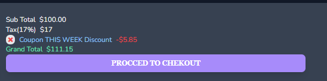

E-commerce

Market App based on Laravel

## About User Side

Application users fortify for authentication. It has 2 langueges to choose from: english and hebrew. What user can do:

- Sign in/up.

- Add/remove products to wishlist.

- Add/remove products to chart.Choose/edit chosen products qty, color, size(according to product properties).Use coupon.
&nbsp; &nbsp;&nbsp; &nbsp;

- Choose languege(english/hebrew).
- Use stripe for payments.
&nbsp; &nbsp;

- Retreview orders details.
&nbsp; &nbsp;

- Update profile.
&nbsp; &nbsp;

- Get in touch with support.

## Layout

### Header

&nbsp; &nbsp;

### Footer

&nbsp; &nbsp;

### Single Product

&nbsp; &nbsp;

### Slider

## About Admin Side

> Admin has it's own login and protected by Fortify.
>
>>Using multi authentication.
>
> Admin control Brands, Categories, Sub-Categories, Sub-Sub-Categories, Products, Slider, Coupons, Discounts, Shipping.
>
>> Using ajax and livewire not to reload page.
>> For UI using fa-fa icons and google icons.
>> Editing or adding new product with multi image upload and preview before uploading.

&nbsp; &nbsp;
&nbsp; &nbsp;
&nbsp; &nbsp;
&nbsp; &nbsp;
&nbsp; &nbsp;
&nbsp; &nbsp;
&nbsp; &nbsp;
&nbsp; &nbsp;
&nbsp; &nbsp;
&nbsp; &nbsp;
&nbsp; &nbsp;
&nbsp; &nbsp;
&nbsp; &nbsp;
&nbsp; &nbsp;
&nbsp; &nbsp;
&nbsp; &nbsp;

## Admin Controls

> Admin has different dashboard and profile managing
>
>> Using charts to retreview products in stock, no option to sign up, added via seeder.
>> Side nav to make it more friendly

&nbsp; &nbsp;
&nbsp; &nbsp;

## Future updates

- Elastic Search
- Upgrade to php 8 and Laravel10
- Tracking Order
- Api for bulk uploading products
- Scheduled Command for notifications
- Cancel order and refund purchase
- Change theme dark/light as default

